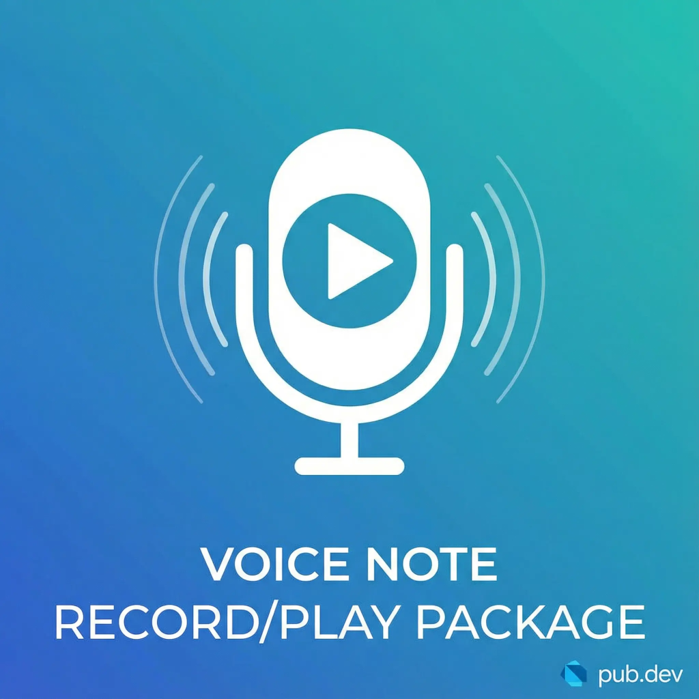
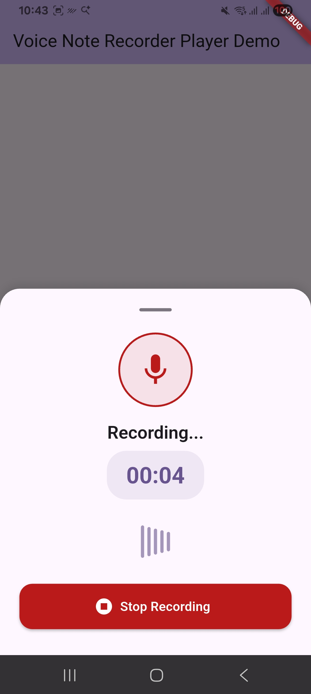
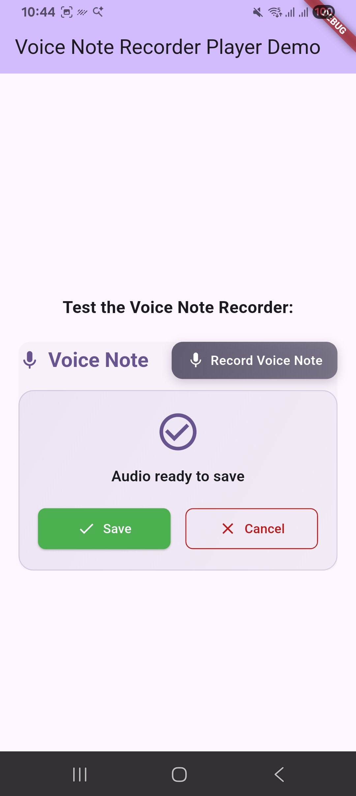
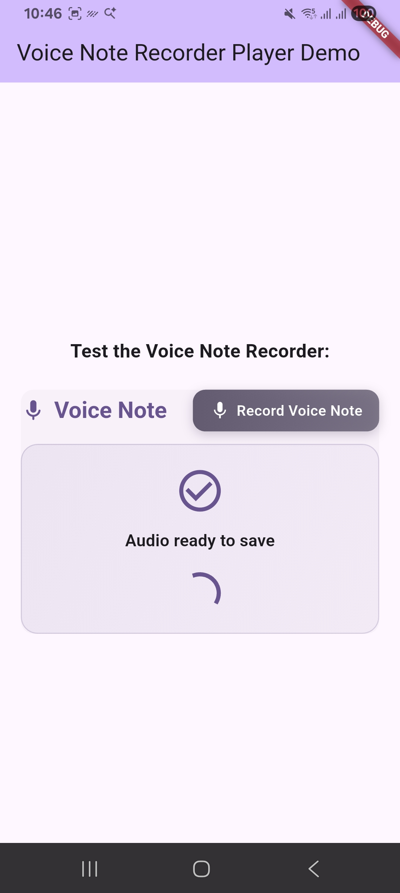

<p align="center">
  
</p>

<p align="center">
  
</p>

# Voice Note Recorder & Player

[](https://pub.dev/packages/voice_note_recorder_player)
[](https://opensource.org/licenses/MIT)

A comprehensive and modern Flutter package for **recording** and **playing** voice notes. It provides a beautiful, customizable UI out of the box, making it easy to integrate voice messaging features into your app.

## 📦 Published on pub.dev

<p align="center">
  <a href="https://pub.dev/packages/voice_note_recorder_player">
    
  </a>
  <a href="https://pub.dev/packages/voice_note_recorder_player">
    
  </a>
  <a href="https://pub.dev/packages/voice_note_recorder_player">
    
  </a>
</p>

<p align="center">
  <strong>📥 Install from pub.dev:</strong><br>
  <code>flutter pub add voice_note_recorder_player</code><br>
  <a href="https://pub.dev/packages/voice_note_recorder_player">👉 View on pub.dev</a>
</p>

---

## 📖 Table of Contents
- [Features](#-features)
- [Screenshots](#-screenshots)
- [Installation](#-installation)
- [Usage](#-usage)
  - [Voice Recorder](#voice-recorder)
  - [Audio Player](#audio-player)
  - [Full Example](#full-example)
- [Customization](#-customization)
- [About the Developer](#-about-the-developer)
- [License](#-license)

## ✨ Features

- 🎙️ **Modern Voice Recorder**: A sleek bottom sheet UI for recording with animations and timer.
- 🎵 **Built-in Audio Player**: Includes a complete player with seeking, playback speed control (0.5x, 1x, 1.5x, 2x), and duration display.
- 🎨 **Fully Customizable**: Change colors, strings, and styles to match your app's theme.
- 💾 **File Handling**: Automatically manages temporary files and callback paths.
- 🔐 **Permissions**: Handles microphone permissions gracefully.
- 🚀 **Easy Integration**: Plug and play with minimal setup.

## 📸 Screenshots

| **Main View** | **Recording** | **Player** |
|:---:|:---:|:---:|
|  |  |  |

| **Save/Cancel** | **Delete** |
|:---:|:---:|
|  |  |

## 📦 Installation

This package is **published on [pub.dev](https://pub.dev/packages/voice_note_recorder_player)** - the official Dart and Flutter package repository.

### Quick Install

Add this to your package's `pubspec.yaml` file:

```yaml
dependencies:
  voice_note_recorder_player: ^0.0.1
```

Then run:
```bash
flutter pub get
```

### Alternative: Install via Command Line

```bash
flutter pub add voice_note_recorder_player
```

### Local Development

*(If you are developing locally, point to your local path)*:
```yaml
dependencies:
  voice_note_recorder_player:
    path: packages/voice_note_recorder_player
```

### Android Setup
Add the following permissions to your `AndroidManifest.xml`:
```xml
<uses-permission android:name="android.permission.RECORD_AUDIO"/>
<uses-permission android:name="android.permission.INTERNET"/>
<uses-permission android:name="android.permission.WRITE_EXTERNAL_STORAGE"/>
```

### iOS Setup
Add the following key to your `Info.plist`:
```xml
<key>NSMicrophoneUsageDescription</key>
<string>We need access to the microphone to record voice notes.</string>
```

## 🚀 Usage

### Voice Recorder

Use `VoiceRecorderBottomSheet` to show the recording interface.

```dart
showModalBottomSheet(
  context: context,
  isScrollControlled: true,
  backgroundColor: Colors.transparent,
  builder: (context) => VoiceRecorderBottomSheet(
    onRecorded: (path) {
      print("Audio recorded at: $path");
      // Handle the recorded file path
    },
  ),
);
```

### Audio Player

Use `AudioPlayerWidget` to play a local audio file.

```dart
AudioPlayerWidget(
  path: filePath,
  primaryColor: Colors.deepPurple, // Optional customization
)
```

### Full Example

Here is how you can implement a complete flow with the `VoiceNoteRecorderPlayer` wrapper widget:

```dart
VoiceNoteRecorderPlayer(
  tempVoiceNotePath: _tempPath,
  savedVoiceNotePath: _savedPath,
  isLoading: _isLoading,
  isLocked: false,
  onOpenRecorder: () {
    // Open recorder logic
  },
  onSaveTemp: () {
    // Save logic
  },
  onCancelTemp: () {
    // Cancel logic
  },
  onDeleteSaved: () {
    // Delete logic
  },
)
```

## 🎨 Customization

You can fully customize the strings and colors.

```dart
VoiceNoteRecorderPlayer(
  // ...
  primaryColor: Colors.orange,
  successColor: Colors.green,
  errorColor: Colors.red,
  strings: VoiceNoteStrings(
    voiceNote: "Message Vocal",
    recordVoiceNote: "Enregistrer",
    recording: "Enregistrement en cours...",
  ),
)
```

## 🛠️ Dependencies Used

This package relies on the following powerful packages:
- [audioplayers](https://pub.dev/packages/audioplayers)
- [record](https://pub.dev/packages/record)
- [provider](https://pub.dev/packages/provider)
- [path_provider](https://pub.dev/packages/path_provider)

## 🧑‍💻 About the Developer

<p align="center">
  
</p>

Hello! 👋 I'm **Radhi MIGHRI**, a passionate Software Engineer specializing in mobile application development with Flutter and native iOS. I am dedicated to building high-quality, user-friendly, and scalable applications.

I created this package to help developers easily integrate voice recording and playback features into their Flutter apps with a modern and customizable UI.

**Connect with me:**
- 🌐 **Portfolio**: [radhi-mighri-portfolio.web.app](https://radhi-mighri-portfolio.web.app/)
- 💼 **LinkedIn**: [Radhi MIGHRI](https://www.linkedin.com/in/radhiMIGHRI)
- 🐙 **GitHub**: [Radhi MIGHRI](https://github.com/radhiMIGHRI)

If you find this package useful, please give it a like 👍 on pub.dev and star ⭐️ on GitHub!

## 📄 License

This project is licensed under the MIT License - see the [LICENSE](LICENSE) file for details.

